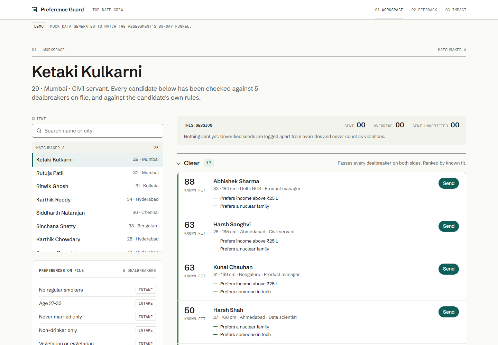
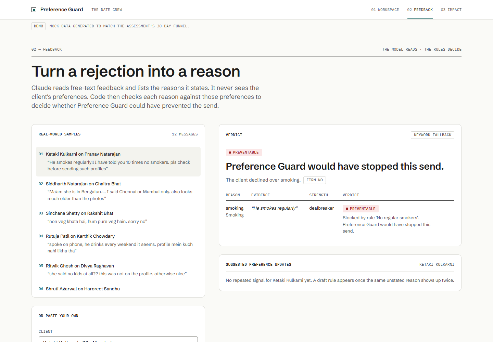
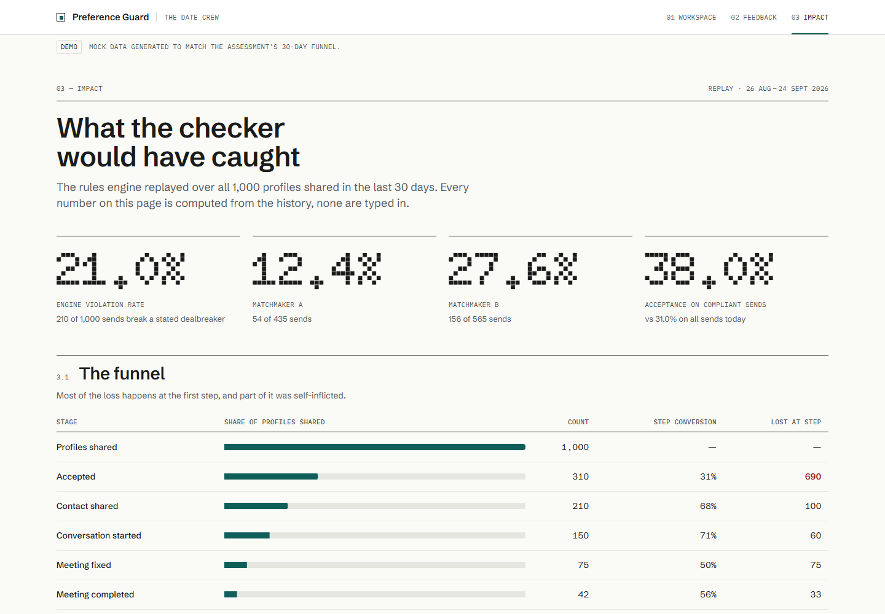
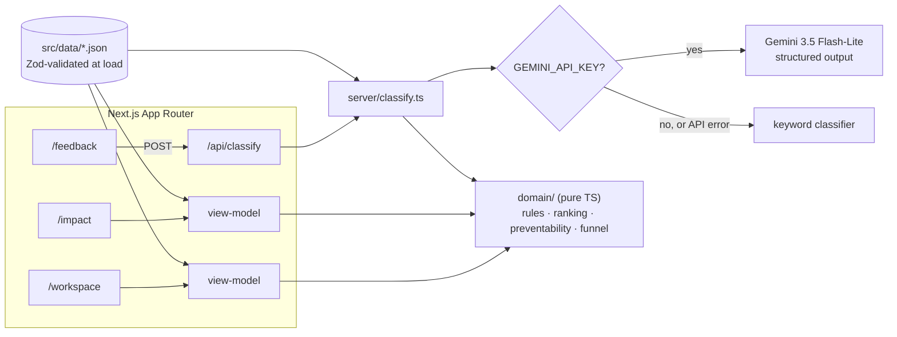

# Preference Guard

A pre-send check for The Date Crew's matchmakers. Before a profile goes out, it is checked against the client's dealbreakers and the candidate's own.

## The problem

In the last 30 days, 1,000 profiles were shared and only 310 were accepted. That gives 42 completed meetings, or 4.2% end to end. Of the 958 profiles that dropped out, 690 (72%) were lost at the first step. About 35% of those rejections cite a reason the client had already stated. That is roughly 241 wasted sends, or 24% of everything sent. Preference Guard stops those sends before they happen.

## What it does

| Workspace | Feedback | Impact |
|---|---|---|
|  |  |  |

- **Workspace**
  - Each candidate for the selected client is checked by a deterministic rules engine in both directions: the client's dealbreakers against the candidate, and the candidate's dealbreakers against the client.
  - Candidates fall into three groups:
    - **Clear:** ranked by known soft-preference fit.
    - **Needs check:** a dealbreaker field is blank. The matchmaker can copy a question for the candidate, or send the profile after confirming it goes out unverified.
    - **Blocked:** each broken rule is named. Sending anyway needs a logged override reason.
  - Unverified sends and overrides are counted separately, and neither is counted as a violation.
- **Feedback**
  - Gemini turns free-text rejections (English or Hinglish, often messy) into structured reasons. Code then decides whether each reason was *preventable*, a *data gap*, *preference drift*, a *new signal*, a *soft mismatch* or *subjective*.
  - When the same unstated reason comes up twice for a client, it becomes a draft rule for the matchmaker to approve.
  - Twelve one-click samples cover every verdict.
- **Impact**
  - Replays the checker over the 30-day history. It shows:
    - the engine violation rate, overall and per matchmaker
    - what the checker would have caught
    - the acceptances it would have wrongly blocked
    - which dealbreaker fields drive the blocks
    - two projections, with their formulas shown
  - Every figure is computed from the data. None is typed into the page.

Mobile layouts are in `docs/*-mobile.png`.

## Live demo

Not deployed yet. See [Deploy](#deploy). The link will be added here once it is live.

## Run locally

Requires Node.js 24 (see `.nvmrc`).

```bash
npm install
cp .env.example .env.local   # optional: add GEMINI_API_KEY to use Gemini
npm run dev                  # http://localhost:3000
```

The app works fully without an API key. The feedback page then uses the offline keyword classifier, and a badge says which classifier ran.

| Script | What it does |
|---|---|
| `npm test` | Vitest: domain, dataset contract, classifier, handler, rate limiter |
| `npm run typecheck` | `next typegen && tsc --noEmit` (TypeScript 7 native compiler) |
| `npm run lint` | Biome lint and format check |
| `npm run generate:data` | Regenerates `src/data/*.json` from seed 20260925 (byte-identical every run) |
| `npm run screenshots` | Captures `docs/*.png` from a running server with the local Chrome (`BASE_URL` to override) |

## Architecture



- `src/domain` holds the whole business logic, as pure functions with no I/O, no clock and no randomness. The Zod schemas in `domain/schemas.ts` are the single source of truth for every type.
- `src/classifier` contains the Gemini and keyword implementations of one `RejectionClassifier` interface. The Gemini client module is guarded with `server-only`; parsing and the prompt are pure and unit-tested.
- `src/server/classify.ts` is the request handler. Its dependencies are injected, so it is unit-tested without Next.js or the network. `route.ts` is a thin wrapper over it.
- Pages build plain view models on the server. Client components only handle interaction.

## Decisions and why

- **The rules are deterministic, not an LLM.** Dealbreakers are yes/no, have to be explainable ("Smoking: occasionally. Client rule: Non-smoker only"), and must run on hundreds of candidates for free.
- **The LLM only reads free text.** Gemini turns feedback into reasons, and code decides whether a reason was preventable. That keeps the metric auditable and the model swappable.
- **The client's preferences are hidden from the LLM.** If the model saw "client: no smokers", it would find smoking in vague feedback, and the *preventable* count would inflate itself.
- **Needs check is kept separate from a violation.** A blank field is a data-quality problem, while a broken rule is a judgment problem. Merging them would inflate the violation rate and hide which problem you have.
- **Ranking uses the lower bound.** Unknown soft-preference fields score 0 for ranking, and the upper bound is shown next to it ("fit 43 (2 unknown, up to 71)"). A sparse profile can never outrank a complete one with equal known fit.
- **Why Gemini 3.5 Flash-Lite.** Classifying one rejection is a small structured task where cost and latency matter more than depth. It is Google's fastest, cheapest stable 3.5 model and thinks minimally by default. The Zod schema is sent as `responseJsonSchema`, so enums are enforced by constrained decoding, and the answer is validated against the same schema before use.
- **No database.** The brief is a 30-day snapshot and the prototype has no users to persist. Session actions (sends, overrides, approvals) live in React state and reset on reload.
- **Why tsx stays.** TypeScript 7's native `tsc` only type-checks. `tsx` runs the data generator and the screenshot script.
- **Past rejections use the keyword classifier.** Draft-rule suggestions look at a client's whole rejection history. Re-reading it through the LLM on every request would cost one API call per past rejection. In production, each rejection would be classified once, when it arrives.

## Assumptions

- The history is mock data, generated by quota to reproduce the brief's funnel exactly: 1,000 → 310 → 210 → 150 → 75 → 42, with Matchmaker A at 44% and B at 21%. 241 rejections cite a stated dealbreaker (200 of them with a known violating value, 41 where the value was blank), and 10 acceptances break one.
- "Engine violation rate" means sends the engine marks Blocked, divided by all sends. It is measured by the engine, not from rejection text, so it is comparable before and after launch.
- Scenario B assumes replacement profiles exist in each client's pool, and that clients react to them the way they reacted to this month's compliant sends.
- Search time is taken from the brief: 2 hours per client per week, spread evenly over sends.
- The rate limit is 10 requests per minute per IP, held in memory. It applies per serverless instance and is for demo purposes only.

## What the replay says

| | Matchmaker A | Matchmaker B | All |
|---|---|---|---|
| Profiles shared | 435 | 565 | 1,000 |
| Acceptance today | 43.9% | 21.1% | 31.0% |
| Rejections the checker would block | 50 | 150 | 200 |
| Rejections flagged needs check | 11 | 30 | 41 |
| **Acceptances wrongly blocked** | **4** | **6** | **10** |
| Engine violation rate | 12.4% | 27.6% | 21.0% |
| Acceptance on compliant sends | 49.1% | 27.6% | 38.0% |

- **The filter has a cost.** Ten clients accepted a profile that broke one of their own rules. The checker would have blocked all ten, which is why overrides exist and why the pilot threshold is "acceptance ≥ 38%" and not the naive 41%.
- **B violates more, but that isn't the whole gap.** Removing violations lifts B from 21% to 27.6%, still far below A's 49%. The rest is process or client mix, which is question 2 of the diagnosis.
- **Smoking and location drive most of the blocks.**

  | Field | Blocked | Needs check |
  |---|---|---|
  | Smoking | 50 | 10 |
  | City | 44 | 10 |
  | Diet | 31 | 0 |
  | Drinking | 29 | 10 |
  | Age | 28 | 0 |
  | Wants children | 10 | 11 |
  | Height | 9 | 0 |
  | Marital status | 9 | 0 |

  The needs-check column points at a data problem. Smoking, drinking, children and relocation are the fields most often left blank on candidate profiles.
- **Projection.**
  - Dropping the 210 violating sends gives 790 sends at 38.0% acceptance and about 41 meetings, and saves around 108 search hours a month.
  - Replacing them with compliant profiles instead gives about 380 acceptances and 51 meetings, against 42 today.

## Model note

The default model is `gemini-3.5-flash-lite`, a stable model. To use another, set `GEMINI_MODEL` (for example `gemini-3.8-flash`). The keyword fallback keeps the demo working either way. Any API error, timeout or schema mismatch falls back to the keyword classifier, and the page says so.

## Deploy

```bash
npx vercel@latest          # link the project
npx vercel@latest --prod
```

Node 24 is selected through `engines` in `package.json`. To use Gemini, add `GEMINI_API_KEY` as an encrypted production environment variable. Check the key's quota and billing in Google AI Studio before sharing the link.

## Next steps

- Model the clients who reject a profile and later accept a near-identical one: timing, fatigue or how the profile was presented.
- Learn soft-preference weights from what clients actually accept, not what they say.
- Move the checker to where matchmakers already work, as a Google Sheets sidebar running the same domain code.
